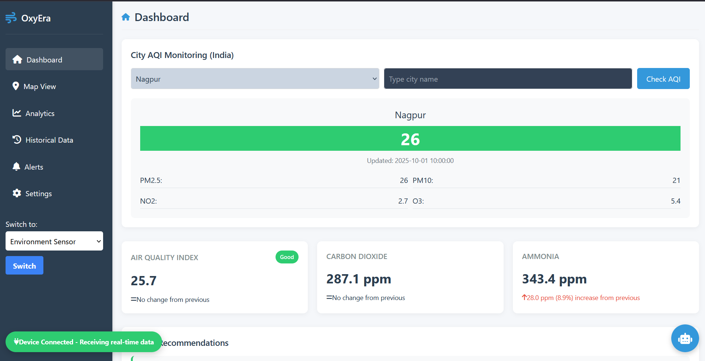

# Oxyera 🌿 | Real-Time Air Quality Monitoring System.

**Oxyera** is a web-based platform that **monitors and visualizes real-time air quality** across cities and user locations. It provides accurate Air Quality Index (AQI) data, helping users track pollution trends and make informed decisions about environmental health. Built with a **responsive design**, Oxyera is lightweight, fast, and user-friendly.  

---

## Features 🌟

- **City-Wise AQI Monitoring:** Track air quality for major cities globally.  
- **Location-Based AQI:** Get precise AQI readings for your current location.  
- **Real-Time Data Analysis:** Visualize air quality trends and patterns instantly.  
- **Responsive & Mobile-Friendly:** Optimized for desktops, tablets, and mobile devices.  
- **Easy to Extend:** Developers can easily integrate additional APIs or features.  

---

## Technology Stack 💻

- **Frontend:** HTML, Tailwind CSS, JavaScript  
- **Backend:** Firebase  
- **APIs & Libraries:** WAQI (World Air Quality Index)  

---

## Screenshots 🖼️

  
*Replace with relevant screenshots to showcase the interface and features.*  

---

## How to Use 🛠️

1. Open the [Oxyera Live Demo](https://dhadhisttiwari.github.io/oxyera-1/) in your browser.  
2. Enter your city or allow location access for precise AQI readings.  
3. Explore real-time air quality trends and visual analytics.  

---

## Contributors 👥

1. **Dhadhist Tiwari** – Integrated all APIs, wrote the core code, and designed the UI/UX.  
   [GitHub](https://github.com/DhadhistTiwari)  
2. **Kamlesh Ghoradkar** – Firebase connection, database setup, and hardware device integration.  
   [GitHub](https://github.com/kamleshghoradkar-A)  
3. **Kamal Chandiramani** – Documentation and visual improvements.  
   [GitHub](https://github.com/kamal930780)  
4. **Harsh Lanjewar** – Testing and quality assurance.  
   [GitHub](https://github.com/harshhllanjewar)  

---

## License 📄

This project is licensed under the **MIT License**. See the [LICENSE](LICENSE) file for details.  

---

*Keywords: Real-Time Air Quality, AQI Tracker, Air Pollution Monitor, Environmental Health, Air Quality Visualization, WAQI API, Firebase, Tailwind CSS, JavaScript, Web-Based AQI Monitor, Air Quality Dashboard.*
